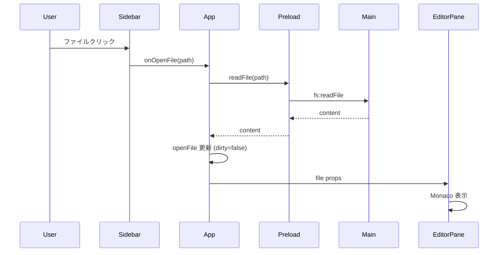
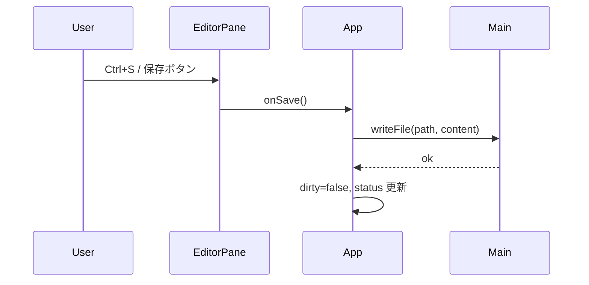
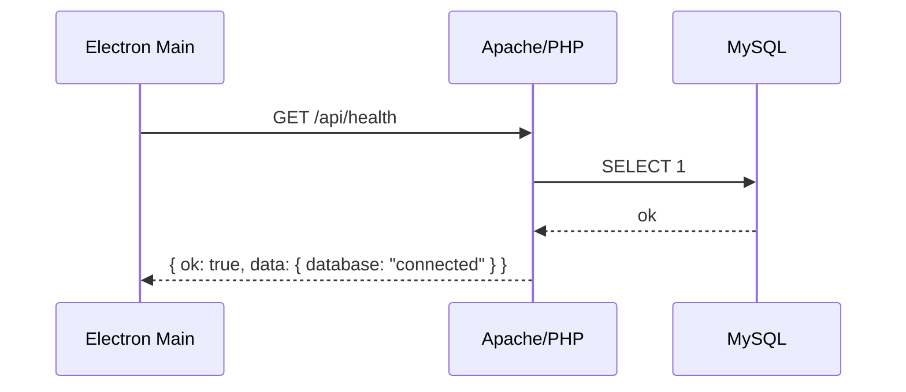
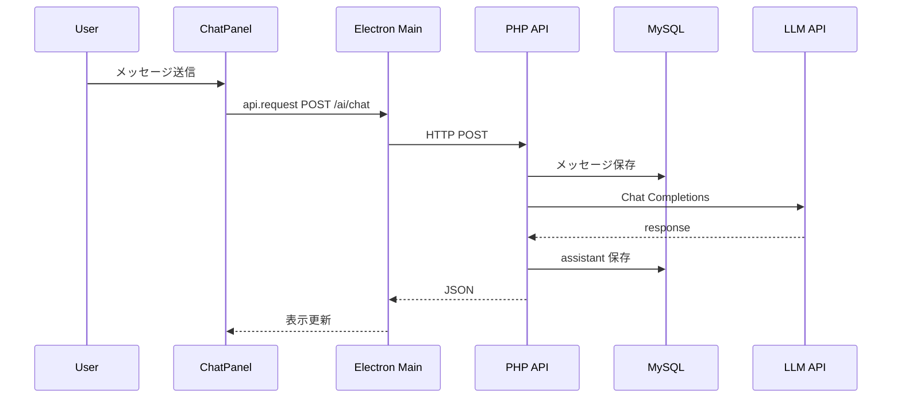

# saforall 設計書

| 項目 | 内容 |
| --- | --- |
| 文書名 | ソフトウェア設計書 |
| 製品名 | saforall |
| 版 | 0.2.0（ドラフト） |
| 最終更新 | 2026-07-04 |
| 関連文書 | [仕様書](./SPECIFICATION.md) / [アーキテクチャ概要](./ARCHITECTURE.md) / [サーバーセットアップ](../server/README.md) |

---

## 1. 設計方針

### 1.1 目標

仕様書の要件を、保守しやすく安全なデスクトップアプリとして実現する。Cursor / VS Code に近い UI モデルを採用し、AI 機能は差し替え可能なモジュールとして分離する。

### 1.2 原則

1. **プロセス分離**: OS・ローカル fs は Electron メイン、UI はレンダラ
2. **最小権限 IPC**: レンダラが使える API は preload で明示したものだけ
3. **永続化は MySQL**: 会話・設定・メタデータは XAMPP の MySQL に保存する
4. **コード本体はディスク**: ソースファイルは DB に入れずローカル fs のみ
5. **API キーはサーバ側**: LLM 呼び出しは PHP 経由を基本とし、キーを保護する
6. **段階的拡張**: 骨格の上にツリー・AI・エージェントを載せる

### 1.3 技術スタック

| 層 | 技術 | 選定理由 |
| --- | --- | --- |
| デスクトップ | Electron | ローカル fs とネイティブ UI |
| UI | React + TypeScript | コンポーネント分割と型安全 |
| エディタ | Monaco Editor | VS Code と同系統の編集体験 |
| ビルド | electron-vite + Vite | 高速な開発体験 |
| Web サーバ | Apache（XAMPP） | ローカル PHP 実行環境として標準的 |
| API | PHP | XAMPP と相性が良く導入が容易 |
| DB | MySQL（XAMPP） | 会話・設定の永続化 |
| クライアント言語 | TypeScript（strict） | IPC・API 境界の型安全 |

---

## 2. システム構成

### 2.1 全体像

```
┌──────────────────────────────────────────────────────────────┐
│                   Electron Renderer (React)                  │
│  ActivityBar │ Sidebar │ Monaco Editor │ ChatPanel           │
└───────────────────────────┬──────────────────────────────────┘
                            │ window.saforall (preload)
┌───────────────────────────▼──────────────────────────────────┐
│                   Electron Main Process                      │
│  Window │ Dialog │ ローカル fs I/O │ HTTP クライアント        │
└─────────┬─────────────────────────────┬──────────────────────┘
          │                             │ HTTP (localhost)
          ▼                             ▼
   ローカルファイルシステム    ┌─────────────────────────────┐
                               │ Apache (XAMPP) + PHP API    │
                               │  server/public → /saforall  │
                               └──────────────┬──────────────┘
                                              │ PDO
                                              ▼
                                       MySQL (XAMPP)
                               settings / chat / workspaces
                                              │
                               PHP AI Proxy ──┼──► 外部 LLM API
```

### 2.2 責務分担

| コンポーネント | 責務 | 持たないもの |
| --- | --- | --- |
| Electron Renderer | UI、編集バッファ、チャット表示 | Node API、DB 直結、API キー |
| Electron Main | ウィンドウ、ダイアログ、ローカル fs、バックエンド HTTP 呼び出し | UI 描画、SQL 直実行 |
| Preload | 限定 API の公開 | ビジネスロジック |
| Apache + PHP | REST API、設定/会話の永続化、LLM プロキシ | ソースコードの実体管理 |
| MySQL | メタデータ・会話・設定の保存 | プロジェクトファイル本体 |

---

## 3. ディレクトリ設計

```
saforall/
├── electron/                 # Electron メイン / preload
├── src/                      # レンダラ (React)
├── server/                   # XAMPP 向け PHP API
│   ├── public/               # DocumentRoot（Apache 公開）
│   ├── api/                  # エンドポイント
│   ├── src/                  # PHP 共通ライブラリ
│   ├── config/               # 接続設定（実ファイルは gitignore）
│   └── sql/                  # スキーマ
├── docs/
├── out/                      # ビルド成果物（gitignore）
└── package.json
```

### 3.1 クライアント側（将来分割）

```
electron/main/
  index.ts
  ipc/
  fs/
  api/                  # バックエンド HTTP クライアント

src/
  components/
  features/
    workspace/
    editor/
    chat/
  lib/ipc.ts
```

### 3.2 サーバ側（現行骨格）

```
server/
  public/
    index.php           # フロントコントローラ
    .htaccess           # 書き換え
  api/
    health.php
  src/
    Database.php
    Response.php
    bootstrap.php
  config/
    database.example.php
    database.php        # ローカル実設定（gitignore）
  sql/
    schema.sql
  README.md
```

---

## 4. UI 設計

### 4.1 レイアウト

| コンポーネント | ファイル | 役割 |
| --- | --- | --- |
| `App` | `src/App.tsx` | 全体レイアウトと状態のオーケストレーション |
| `ActivityBar` | `src/components/ActivityBar.tsx` | フォルダオープン、チャット開閉 |
| `Sidebar` | `src/components/Sidebar.tsx` | ワークスペース一覧 |
| `EditorPane` | `src/components/EditorPane.tsx` | Monaco・タブ・保存 |
| `ChatPanel` | `src/components/ChatPanel.tsx` | 会話 UI |
| `StatusBar` | `src/components/StatusBar.tsx` | 状態表示 |

### 4.2 状態モデル（現状）

```ts
// 概念モデル
type AppState = {
  workspacePath: string | null
  openFile: OpenFile | null
  chatOpen: boolean
  status: string
}

type OpenFile = {
  path: string
  content: string
  language: string
  dirty: boolean
}

type ChatMessage = {
  id: string
  role: 'user' | 'assistant' | 'system'
  content: string
}
```

### 4.3 状態モデル（目標）

```ts
type WorkspaceState = {
  rootPath: string | null
  tree: TreeNode[]
  expandedPaths: Set<string>
}

type EditorState = {
  tabs: OpenFile[]
  activePath: string | null
  selection?: { startLine: number; endLine: number; text: string }
}

type ChatState = {
  messages: ChatMessage[]
  streaming: boolean
  error: string | null
}
```

### 4.4 画面遷移

アプリは単一ウィンドウ・単一画面構成。モーダルは OS ダイアログ（フォルダ選択）と、将来の設定画面を想定する。ルート遷移（React Router）は用いない。

### 4.5 言語モード判定

拡張子から Monaco の `language` を決定する（`App.tsx` の `languageFromPath`）。未知拡張子は `plaintext`。

---

## 5. IPC 設計

### 5.1 公開 API（`window.saforall`）

| メソッド | 方向 | 説明 |
| --- | --- | --- |
| `openDirectory()` | R→M | フォルダ選択ダイアログ。キャンセル時 `null` |
| `readFile(path)` | R→M | UTF-8 テキスト読取 |
| `writeFile(path, content)` | R→M | UTF-8 テキスト書込 |
| `readDir(path)` | R→M | 直下エントリ一覧（ドットファイル除外） |
| `stat(path)` | R→M | ファイル種別・サイズ・更新時刻 |

チャネル名は `dialog:openDirectory` / `fs:readFile` 等。`invoke` / `handle` の request-response モデルを用いる。

### 5.2 将来追加 IPC

| メソッド | 説明 |
| --- | --- |
| `api.health()` | バックエンド疎通 |
| `api.request(method, path, body?)` | 汎用 REST 呼び出し |
| `fs.readDirRecursive` / `fs.watch` | ツリー・変更監視 |
| `workspace.applyPatch(patches)` | AI 提案の一括適用 |

バックエンド URL はメインプロセス設定（既定 `http://localhost/saforall/api`）に置く。レンダラは URL を直接知らなくてよい。

### 5.3 パス検証（設計方針）

書込・読取は原則ワークスペースルート配下に制限する。

```
resolved = path.resolve(target)
root = path.resolve(workspaceRoot)
allow = resolved === root || resolved.startsWith(root + path.sep)
```

シンボリックリンクや `..` による脱出を拒否する。実装は `electron/main/fs` に集約する。

### 5.4 セキュリティ設定

```ts
webPreferences: {
  preload: '...',
  contextIsolation: true,
  nodeIntegration: false,
  sandbox: false  // preload で Node 組み込みを使うため現状 false
}
```

将来的に sandbox 有効化を検討する。その場合 preload の実装方針を見直す。

---

## 6. バックエンド設計（Apache / PHP / MySQL）

### 6.1 XAMPP 配置

開発マシンでは次のいずれかで `server/public` を公開する。

1. **推奨**: Apache の Alias
   - `Alias /saforall "D:/Development/saforall/server/public"`
2. **簡易**: `C:\xampp\htdocs\saforall` へジャンクション / コピー

既定アクセス:

| URL | 内容 |
| --- | --- |
| `http://localhost/saforall/` | API ルート |
| `http://localhost/saforall/api/health` | ヘルスチェック |

### 6.2 ルーティング

`public/index.php` がフロントコントローラとなり、パスを `api/*.php` へ振り分ける。`.htaccess` で `mod_rewrite` を用いる。

### 6.3 レスポンス形式

成功:

```json
{ "ok": true, "data": { } }
```

失敗:

```json
{ "ok": false, "error": { "code": "DB_CONNECTION_FAILED", "message": "..." } }
```

HTTP ステータスは 200 / 4xx / 5xx を適切に返す。

### 6.4 データベーススキーマ（概要）

| テーブル | 用途 |
| --- | --- |
| `settings` | キー・バリュー設定（model, base_url, api_key 等） |
| `workspaces` | 最近開いたワークスペースパス |
| `chat_sessions` | 会話セッション |
| `chat_messages` | セッション内メッセージ |

詳細は `server/sql/schema.sql` を正とする。

### 6.5 ER 概要

```
workspaces (id, path, last_opened_at)
settings (setting_key, setting_value, updated_at)

chat_sessions (id, workspace_id?, title, created_at, updated_at)
      │
      │ 1:N
      ▼
chat_messages (id, session_id, role, content, created_at)
```

### 6.6 Electron からの呼び出し方針

```
Renderer → preload api.* → Main HTTP client → Apache/PHP → MySQL
```

- CORS: 開発時は許可（Electron はメイン経由なら CORS 不要だが、将来のデバッグ用に付与）
- タイムアウト: 接続 3 秒、LLM 系は長め（60 秒〜）
- バックエンド停止時: `api.health` 失敗を StatusBar に表示し、編集機能は継続

---

## 7. AI サブシステム設計（目標）

### 7.1 コンポーネント

```
Renderer ChatPanel
    │
    ▼
Electron Main (HTTP)
    │  POST /api/ai/chat
    ▼
PHP AI Proxy
    │  設定・履歴を MySQL から読取/保存
    │  Provider 呼び出し
    ▼
External LLM API
```

### 7.2 プロバイダ設定（MySQL `settings`）

| key | 意味 |
| --- | --- |
| `llm.api_key` | 秘密鍵（PHP のみが読む） |
| `llm.base_url` | API ベース URL |
| `llm.model` | モデル名 |

### 7.3 コンテキスト組み立て

優先度の高い順にトークン予算内へ収める。

1. システムプロンプト（製品ルール・ユーザールール）
2. アクティブファイル（パス + 内容、大きすぎる場合は抜粋）
3. 選択範囲
4. 関連ファイル（ユーザー指定 or 簡易ヒューリスティック）
5. 会話履歴（直近 N ターン、MySQL から取得）

### 7.4 コード適用フロー（v0.3 以降）

1. モデルが unified diff または置換ブロックを返す
2. UI で差分プレビュー
3. ユーザー承認後 Electron の `writeFile` / `applyPatch`
4. エディタバッファを再同期

### 7.5 エージェント（v0.4 以降）

ツール定義例:

| ツール | 作用 | 実行場所 |
| --- | --- | --- |
| `read_file` | ファイル読取 | Electron Main |
| `list_dir` | ディレクトリ一覧 | Electron Main |
| `search` | テキスト検索（後続） | Electron Main |
| `write_file` | ファイル書込（要確認） | Electron Main |

書込系ツールはデフォルトでユーザー確認を挟む。エージェントのオーケストレーションは PHP または Electron 側で行い、fs ツールだけ Electron に委譲する。

---

## 8. 主要シーケンス

### 8.1 ファイルを開く



### 8.2 保存



### 8.3 ヘルスチェック



### 8.4 AI チャット（目標）



---

## 9. エラーハンドリング

| 発生箇所 | 方針 |
| --- | --- |
| ファイル読取失敗 | StatusBar にメッセージ、エディタは変更しない |
| ファイル保存失敗 | StatusBar にメッセージ、`dirty` は維持 |
| フォルダ選択キャンセル | 何もしない |
| Apache / MySQL 未起動 | StatusBar に「バックエンド未接続」、編集は継続 |
| DB 接続失敗 | `/api/health` が error、設定画面で案内 |
| LLM タイムアウト / 4xx/5xx | チャットにエラーバブル、再送可能 |

例外はメイン / PHP で握りつぶさず、JSON または IPC でメッセージ化する。

---

## 10. 設定・秘密情報

| 種類 | 保存場所 |
| --- | --- |
| MySQL 接続 | `server/config/database.php`（gitignore） |
| LLM API キー | MySQL `settings`（PHP のみ参照）または `server/config` |
| バックエンド URL | Electron 側設定（既定 localhost） |

レンダラは「設定済みかどうか」「モデル名」など非秘密情報のみ参照する。

---

## 11. ビルド・配布

| コマンド | 出力 |
| --- | --- |
| `npm run dev` | 開発サーバ + Electron |
| `npm run build` | `out/main`, `out/preload`, `out/renderer` |
| `npm run typecheck` | `tsconfig.web` / `tsconfig.node` |

バックエンドは XAMPP の Apache / MySQL を起動して利用する（ビルド不要）。

`package.json` の `main` は `./out/main/index.js`。

配布（v1.0 目標）は electron-builder 等でインストーラを生成する想定。サーバは別途デプロイ設計が必要。

---

## 12. テスト方針

| 種類 | 対象 | 時期 |
| --- | --- | --- |
| 手動確認 | 起動・開く・編集・保存・チャット UI | MVP |
| 手動確認 | `/api/health`、phpMyAdmin でのテーブル確認 | v0.1.1 |
| 単体テスト | パス検証、言語判定、プロンプト組み立て | v0.2〜 |
| 結合テスト | IPC ハンドラ、PHP API + MySQL | v0.2〜 |

---

## 13. 実装ロードマップと設計タスク

| フェーズ | 設計・実装タスク |
| --- | --- |
| v0.1.1 | XAMPP 公開設定、schema 適用、health API |
| v0.2 | Electron→PHP HTTP、設定/会話 CRUD、LLM プロキシ、ChatPanel 接続 |
| v0.3 | 再帰ツリー、複数タブ、選択範囲コンテキスト、差分適用 UI |
| v0.4 | ツール実行ループ、パス検証強化、確認ダイアログ |
| v1.0 | ターミナル、設定 UI、配布パイプライン |

---

## 14. 現状実装との対応

| 設計要素 | 現状 |
| --- | --- |
| Electron 3 プロセス構成 | 実装済 |
| IPC 基本 5 API（fs / dialog） | 実装済 |
| UI 4 ペイン + StatusBar | 実装済 |
| PHP API 骨格 + health | 追加済 |
| MySQL スキーマ | 追加済 |
| Electron ↔ PHP 接続 | 未実装 |
| AI Proxy | 未実装 |
| パス検証 | 未実装 |

---

## 15. 改訂履歴

| 版 | 日付 | 内容 |
| --- | --- | --- |
| 0.1.0 | 2026-07-04 | 初版作成 |
| 0.2.0 | 2026-07-04 | XAMPP（Apache / MySQL / PHP）バックエンド設計を追加 |
